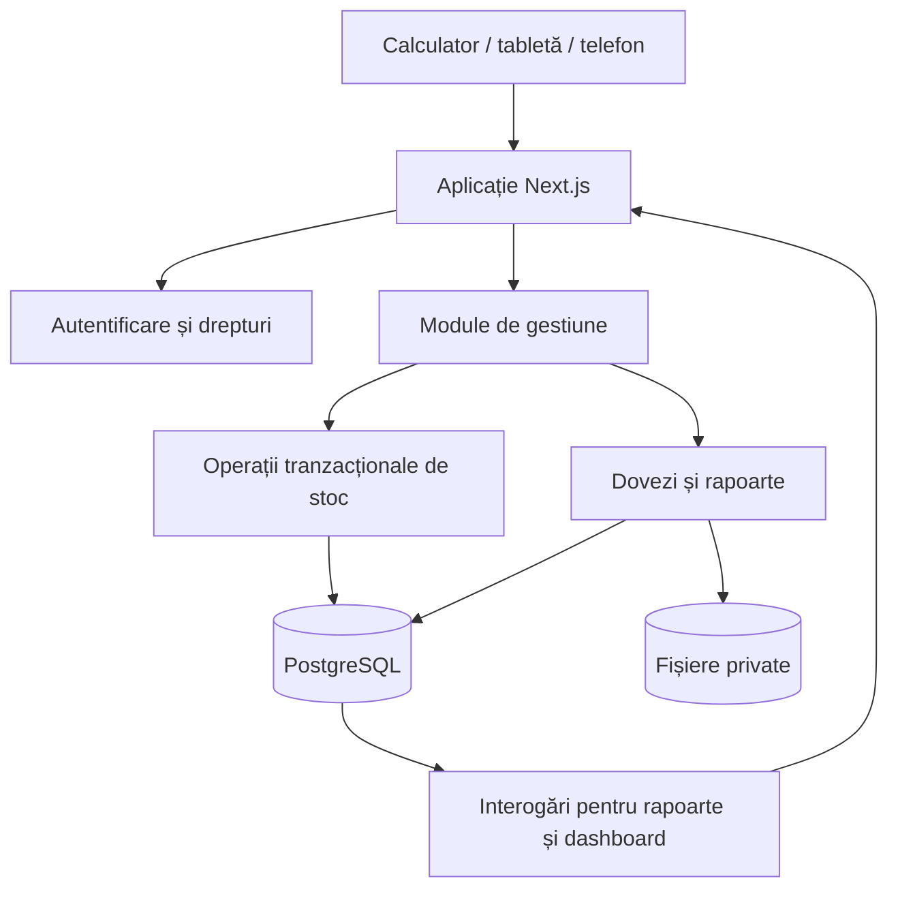

# Arhitectură — Gestiune substații

Actualizare D69: operațiile curente folosesc numai produs + cantitate, fără praguri, loturi comerciale sau expirare. Identificatorii vechi rămân suport intern al jurnalului. [Contractul curent](QUANTITY-INVENTORY.md).

Versiune de plan: 1.2 · 10 septembrie 2026 · Limbă interfață: română

**Actualizare D61–D64:** stoc permanent pe mașină, preluat între ture; formula curentă este `preluat = consumat + rămas în mașină + retur fizic`. Titularul închide după finalul programat dacă nu există retur; magazia confirmă numai circuitul cu retur fizic. Modelul vechi de mai jos este înlocuit în aceste puncte de [VEHICLE-STOCK](VEHICLE-STOCK.md), inclusiv schema, drepturile și criteriile de acceptare.

Actualizare de scop: beneficiarul dorește deocamdată un MVP funcțional pentru prezentare, cu găzduire gratuită. Păstrăm fluxurile de gestiune și construim M00–M09, apoi P01 pentru publicarea demo-ului. Datele de prezentare sunt fictive. M10–M11 și cerințele exclusiv operaționale din acest document sunt pentru o etapă ulterioară.

## 1. Scop și cerințe confirmate

Aplicația urmărește medicamente, consumabile și accesorii în una sau mai multe substații. Roșiori este prima substație, introdusă ca înregistrare configurabilă, fără reguli speciale în cod.

- Există două perspective: „Logistică / Magazie”, pentru distribuție și vedere de ansamblu, și „Tura mea”, pentru șeful de tură, limitat la propriile fișe și ture. [Fluxul detaliat](WORKFLOWS.md) include cerințele confirmate și propunerile tehnice.
- Șeful de tură inițiază „Start tură” și alege mașina dintre cele disponibile. Magazia pregătește produsele, loturile și cantitățile fișei; șeful de tură acceptă versiunea primită fără să o editeze.
- Acceptarea fișei confirmă predarea și pornește efectiv tura în aceeași tranzacție. Pregătirea și trimiterea fișei nu modifică stocurile.
- Recepția mărește stocul depozitului substației.
- Predarea către titular, pentru o mașină și o tură, scade imediat stocul disponibil în depozit.
- Numai angajații activi marcați ca titulari pot primi produse pentru ture noi.
- La finalul turei se înregistrează cantitățile consumate și returnate. În cerința beneficiarului, „pe minus” înseamnă consumat.
- Returul confirmat încarcă înapoi depozitul; consumul nu mai scade încă o dată depozitul.
- Închiderea turei permite document, fotografie și/sau semnătură cu degetul pe ecran.
- Rapoartele au filtre pe tură, zi, săptămână, substație, titular, mașină și produs.
- Dashboardul folosește imaginea furnizată drept reper de culori, fonturi și aspect, fără a prelua funcționalități din ea (D37, confirmat în M01).
- Implementarea se face incremental, în conversații separate, cu salvări în Git.

## 2. Decizii de pornire propuse

Acestea sunt alegeri de proiectare, nu cerințe deja confirmate de beneficiar:

- O instituție administrează mai multe substații; prima versiune nu este o platformă comercială pentru instituții independente.
- Fiecare substație are inițial un depozit disponibil. Structura admite ulterior mai multe locații.
- Angajatul poate exista în evidență fără cont. În fluxul principal, șeful de tură este titularul responsabil, cu cont individual legat de angajat, necesar pentru pornirea și acceptarea propriei ture. La închidere, colectarea unei semnături pe dispozitivul gestionarului poate rămâne disponibilă, cu identități distincte.
- Gestionarul confirmă returul fizic și închide definitiv tura. Titularul poate pregăti declarația pentru tura proprie.
- Politica dovezilor este configurabilă pe substație: `optional` sau `at_least_one`. Propunerea inițială este `at_least_one`: document/fotografie SAU semnătură. Ambele pot fi atașate.
- Medicamentele se urmăresc pe lot și expirare; pentru alte produse această urmărire poate fi opțională.
- Aplicația funcționează online în prima versiune. Salvarea finală necesită confirmarea serverului.
- Produsele se gestionează în unitatea de bază stabilită la creare: fiolă, comprimat, bucată etc. Conversiile cutie–bucată se adaugă separat dacă sunt necesare.

## 3. Organizare tehnică

Un monolit modular: o singură aplicație și o singură bază de date, cu responsabilități delimitate în cod. Acest lucru permite ca emiterea, returul și închiderea să fie salvate coerent.

Cele două perspective folosesc același proiect, cu navigație și operații permise după identitatea autentificată. Vederea de ansamblu nu amestecă soldurile substațiilor; fiecare distribuție are o substație concretă.

| Componentă | Alegere propusă | Scop |
| --- | --- | --- |
| Aplicație | Next.js + TypeScript | Pagini, formulare și operații pe server în același proiect |
| Interfață | Tailwind CSS + shadcn/ui | Componente consecvente, aspect minimalist și adaptare la telefon |
| Date | PostgreSQL prin Supabase | Relații, tranzacții și izolare între substații |
| Conturi | Supabase Auth | Autentificare; rolurile aplicației se păstrează în tabele proprii |
| Fișiere | Supabase Storage, spațiu privat | Documente, fotografii, semnături și rapoarte generate |
| Validare | Scheme TypeScript/Zod și constrângeri SQL | Validări în formular, pe server și în baza de date |
| Verificare | Vitest, teste SQL și Playwright | Reguli de gestiune, acces și fluxuri complete |
| Export | PDF și CSV în prima versiune | Raport imprimabil și date deschise în Excel; XLSX poate urma separat |
| Versionare | Git, un singur repository | Cod, migrări SQL, documentație și istoricul modulelor |

Versiunile exacte și managerul de pachete se fixează în M00 și se păstrează în lockfile. Nu se fac actualizări generale de dependențe în timpul altui modul.

Fundația M00 adoptă Next.js App Router 16.3.4, React 19.3.0, TypeScript 5.9.3, Node.js 24.19.0 și npm 10.2.0; toate versiunile directe sunt exacte în `package.json`, cu `package-lock.json`. Tailwind CSS este configurat; M01 folosește componente React comune și controale native (D38). M02 introduce Supabase Auth/PostgreSQL, clienți SSR și prima migrare cu RLS și audit. Repository-ul comun este `razvanstav/ambulanta`, cu progresul validat pe `main`. Configurarea reală, contractele și testele de acces sunt în [ACCESS](ACCESS.md).

Ținta de publicare pentru demo este Netlify Free + Supabase Free. Netlify construiește aplicația din Git și o servește pe o adresă gratuită `*.netlify.app`; domeniul propriu este opțional. Supabase furnizează datele, conturile și spațiul privat pentru fișiere. Se verifică limitele planurilor la configurare și înaintea prezentării; nu se presupune utilizare nelimitată și nu se activează abonamente plătite pentru demo. [Plan Netlify](https://www.netlify.com/pricing/), [Plan Supabase](https://supabase.com/pricing).

Fluxul de salvare rămâne separat de publicare: commit local → trimitere în repository-ul distant configurat → build/publicare pe ramura aleasă. Modificările bazei de date rămân migrări explicite; nu sunt aplicate automat doar pentru că s-a publicat interfața.

Next.js oferă operații HTTP pe server prin Route Handlers. Alegerea de a păstra aplicația într-un singur proiect este recomandarea acestui plan. [Documentația Next.js](https://nextjs.org/docs/app/getting-started/route-handlers).



Browserul nu modifică direct soldurile. Operațiile de stoc se execută prin funcții tranzacționale în PostgreSQL, apelate de server. Toate verifică utilizatorul autentificat și substația; identitatea nu se ia dintr-un `user_id` furnizat de formular.

Supabase permite funcții de bază de date apelabile din aplicație. Funcțiile privilegiate vor avea drepturi de execuție restrânse, `search_path` fix și verificări explicite ale rolului și substației. [Documentația funcțiilor](https://supabase.com/docs/guides/database/functions).

M04–M06 sunt implementate prin migrările `202609100003`–`202609100005`.
Contractele concrete sunt în [CATALOG](CATALOG.md), [INVENTORY](INVENTORY.md) și
[SHIFTS](SHIFTS.md). Motorul intern `app_private.move_stock` actualizează jurnalul
și soldurile atomic; `post_receipt` și `accept_issue_sheet` sunt comenzile publice.
Blocarea pe instituție este comună cu administrarea și revocările. Proiecția
de sold nu poate fi scrisă de client. Metadatele produsului sunt fixe de la primul
lot; liniile fișelor păstrează instantanee ale denumirii, unității și lotului.

Beneficiarul a solicitat publicare demo anticipată după M06 (D51), separat de
P01 integral. Cheia secretă rămâne locală; pe găzduire funcționează conturile
existente, iar crearea Auth se face din mediul local (D54).

## 4. Utilizatori, angajați și drepturi

Angajatul este persoana din evidența substației. Contul de utilizator este identitatea care se autentifică. Legătura poate lipsi pentru un angajat doar înregistrat, dar este obligatorie pentru șeful de tură care operează „Tura mea”. Proprietatea „titular” aparține apartenenței angajatului la substație, nu înlocuiește un rol de acces. În acest flux șeful de tură este titularul responsabil, distinct de șeful substației.

| Rol / proprietate | Drepturi propuse |
| --- | --- |
| Administrator instituție | Creează substații, atribuie roluri și vede toate substațiile |
| Logistică centrală / șefă magazie | Vede ansamblul tuturor substațiilor instituției și poate recepționa, pregăti/trimite fișe, confirma retururi și închide ture; rol instituțional acordat explicit, fără drept implicit de administrare a conturilor |
| Șef substație | Administrează personalul local, bifează titulari, vede stocuri și rapoarte; aprobă corecții |
| Gestionar local | Funcțiile de magazie și vederea activității numai în substațiile atribuite |
| Șef de tură / titular cu cont | Inițiază propria cerere, alege o mașină disponibilă, acceptă fișa primită fără editare; vede numai fișele/turele proprii, declară consumul/returul propriu, atașează dovezi și semnează |
| Angajat fără proprietatea titular | Rămâne în evidență; nu apare ca destinatar la predare |

Un utilizator poate avea mai multe roluri. Șeful poate fi și gestionar prin atribuire explicită. Conturile operaționale sunt individuale. Deactivarea proprietății „titular” oprește predările noi, dar permite rezolvarea turelor deja deschise și păstrează istoricul.

Filtrarea pe substație se aplică la pagini, operații, rapoarte și fișiere. În baza de date se folosesc politici Row Level Security și permisiuni explicite; acestea nu sunt înlocuite de filtrul vizibil din dashboard. [Documentația RLS](https://supabase.com/docs/guides/database/postgres/row-level-security).

Pentru „Tura mea”, apartenența la aceeași substație nu este suficientă: se verifică și că fișa/tura aparține angajatului legat de cont. Lista mașinilor disponibile expune doar informațiile necesare selecției, fără detalii despre turele altora. Rolul de logistică centrală permite accesul instituțional explicit, iar un gestionar local nu îl poate obține printr-un parametru sau prin schimbarea meniului. Acceptarea aparține titularului autentificat; magazia nu acceptă în numele lui.

## 5. Fluxul turei

Stări propuse: `draft` → `awaiting_issue` → `awaiting_acceptance` → `open` → `pending_close` → `closed`. Înainte de predare, o cerere poate deveni `cancelled`. Acceptarea ca moment al predării și pornirii este confirmată (D33); rezervarea mașinii în așteptare este propunerea D35. Detaliile sunt în [WORKFLOWS](WORKFLOWS.md).

1. **Start tură:** șeful de tură își selectează mașina activă, aptă de utilizare și liberă în substația autorizată. Confirmarea creează propria cerere `awaiting_issue` și rezervă mașina atomic. Identitatea titularului vine din sesiune. Stocul nu se modifică, iar tura încă nu este pornită.
2. **Pregătire și trimitere:** magazia stabilește produsele, loturile și cantitățile. Ciorna se poate pregăti anterior, dar versiunea trimisă este legată de cererea, mașina și titularul concret. Trimiterea produce `awaiting_acceptance`, fără scădere sau rezervare de cantități. Fără fișă, șeful vede „În așteptarea fișei”.
3. **Acceptare și predare:** șeful de tură acceptă versiunea exactă, fără editare. Serverul verifică din nou identitatea, drepturile, eligibilitatea, mașina, versiunea și loturile. O singură tranzacție salvează acceptarea, mută cantitățile din depozit în tură și trece în `open`. `started_at` este momentul acestei tranzacții, iar data operațională derivă din el în `Europe/Bucharest`; intervalul planificat este separat.
4. **Neconcordanță sau anulare:** titularul semnalează diferențele, iar magazia emite o versiune nouă; versiunea veche nu se mai poate accepta. Până la predare, anularea cererii eliberează mașina și invalidează fișa, cu audit. Schimbarea mașinii cere o cerere nouă. Fișa acceptată nu se modifică.
5. **Suplimentare:** magazia trimite o nouă fișă, acceptată de titular prin același mecanism atomic. Operația este separată, permisă numai în `open`; nu repornește tura și nu schimbă mașina, titularul sau momentul inițial.
6. **Declarație:** șeful de tură completează consumul și returul propriu pe lot/alocare, pregătește raportul și dovezile, apoi trimite spre verificare (`pending_close`).
7. **Confirmare finală:** magazia verifică returul fizic. Într-o singură tranzacție înregistrează consumul, returul, versiunea finală a raportului și închiderea.

Titularul și mașina sunt unici între cererile/turele în `awaiting_issue`, `awaiting_acceptance`, `open` și `pending_close`, cu verificare în PostgreSQL. Ciorna netrimisă `draft` nu rezervă mașina sau cantități. Anularea înainte de predare ori închiderea confirmată eliberează mașina. După prima predare, substația, titularul și mașina nu se schimbă prin simpla editare a formularului.

Pentru fiecare alocare dintr-un lot:

```text
total_predat = predare_inițială + suplimentări
total_predat = consumat + returnat
consumat >= 0
returnat >= 0
```

La neconcordanță, închiderea este blocată cu un mesaj clar. Diferența nu se transformă automat în consum. Pierderile, deteriorările și alte excepții se introduc ulterior ca operații explicite dacă procedura beneficiarului le cere.

## 6. Motorul de stoc

Soldul nu este o cifră editabilă din formular. Evidența de bază este jurnalul nemodificabil al mișcărilor. O proiecție de solduri se actualizează în aceeași tranzacție și poate fi reconciliată cu jurnalul.

Fiecare mișcare păstrează produsul/lotul, cantitatea pozitivă, sursa, destinația, substația, documentul sau tura, autorul, momentul înregistrării și cheia de unicitate a operației.

| Operație | Sursă → destinație | Efect asupra depozitului |
| --- | --- | --- |
| Recepție / stoc inițial | Exterior → depozit | Crește |
| Predare / suplimentare | Depozit → tură | Scade |
| Consum la închidere | Tură → consumat | Niciun nou efect |
| Retur la închidere | Tură → depozit | Crește |
| Corecție | Mișcare compensatorie referită la operația originală | Efect explicit, cu motiv și drepturi |

Exterior și consumat sunt destinații logice de evidență. Nu sunt depozite din care se distribuie. Locația turei arată produsele predate care încă trebuie justificate.

Exemplu: 100 seringi în depozit → 10 predate → 90 în depozit și 10 în tură → 6 consumate + 4 returnate → 94 în depozit și 0 în tură.

Reguli obligatorii pentru implementare:

- Recepțiile, predările și închiderile sunt atomice: toate liniile reușesc sau nu se aplică nimic.
- Acceptarea folosește exclusiv liniile versiunii de fișă emise de magazie, citite pe server. Interfața titularului nu trimite cantități arbitrare către motor. Identitatea acceptantului și autorul fișei sunt păstrate separat. Fișa pregătită sau trimisă nu scade și nu rezervă cantități.
- Acceptarea are unicitate pe versiunea fișei și tranziția turei, inclusiv la chei de cerere diferite. Fișa retrasă/înlocuită, cererea anulată, stocul insuficient sau pierderea eligibilității blochează întreaga operație; nu rămân acceptări ori mișcări parțiale. Retragerea/înlocuirea și acceptarea concurentă se serializează pe aceleași înregistrări.
- Soldurile locațiilor deținute nu pot deveni negative.
- Fiecare comandă are o cheie de idempotență: repetarea aceleiași cereri după dublu clic sau timeout întoarce rezultatul deja salvat. Aceeași cheie cu alt conținut este respinsă.
- Concurența se controlează prin blocarea turei și soldurilor necesare într-o ordine stabilă, apoi reverificarea disponibilității. PostgreSQL oferă blocări la nivel de rând pentru aceste operații. [Documentația PostgreSQL](https://www.postgresql.org/docs/current/explicit-locking.html).
- Închiderea are și o unicitate pe tura/versiunea finalizată, astfel încât două cereri cu chei diferite nu pot dubla returul.
- Operațiile validate nu se șterg și nu se rescriu. Se corectează prin mișcări legate de original.
- Cantitățile folosesc numere zecimale exacte în SQL, nu calcule cu virgulă mobilă. Produsele indivizibile acceptă numai numere întregi.
- Disponibilul pentru predare exclude loturile expirate sau blocate. Se propun primele loturile care expiră mai devreme.
- Returul revine pe lotul din care s-a făcut predarea. Un lot expirat între predare și retur rămâne exclus din disponibilul pentru o nouă distribuire.

Nu se presupune că stocul poate fi reconstituit din simple totaluri introduse manual. Testele de reconciliere compară jurnalul, soldurile și cantitățile turelor.

## 7. Date și relații

Schema de mai jos descrie entitățile necesare, fără a crea de pe acum toate tabelele pentru modulele viitoare.

| Entitate | Informații principale și relații |
| --- | --- |
| `substations` | Nume, cod, activă/inactivă, fus orar, politică dovezi |
| `profiles` | Contul autentificat, nume afișat, legătură opțională la angajat |
| `institutions` | Instituția și starea activă; limita de izolare pentru toate substațiile și profilurile M02 |
| `role_assignments` | Implementat M02: rol, utilizator, instituție, substație opțională; administrator/logistică sunt globale, celelalte roluri obligatoriu locale, impus prin constrângeri |
| `employees` | Identitate instituțională, cod unic, nume, cont opțional unic; fără date despre pacienți |
| `employee_assignments` | Angajat, substație, funcție, activ, `is_titular`; unic pe apartenență; starea activă este locală |
| `vehicles` | Substație, număr de înmatriculare/indicativ, stare activă și aptă de utilizare; ocuparea derivă din cereri/ture |
| `products` | Cod, denumire, categorie, unitate de bază, precizie, urmărire lot/expirare |
| `station_product_settings` | Produs, substație, prag minim, activ local |
| `stock_lots` | Substație, produs, cod lot, expirare, blocat; lot intern pentru produsele neurmărite comercial |
| `inventory_locations` | Substație, tip, referință la depozit sau tură |
| `stock_balances` | Sold pe locație și lot; unic pe această pereche |
| `inventory_operations` | Tip, autor, moment, cheie idempotentă, document/tură, referință de corecție |
| `inventory_movements` | Operație, lot, sursă, destinație, cantitate; jurnal append-only |
| `receipts`, `receipt_lines` | Furnizor ca text în MVP, număr document, dată, produs, lot, cantitate; legătură la operație |
| `shifts` | Cererea și tura: substație, mașină, titular, interval planificat, moment efectiv `started_at`, dată operațională, stare, versiune |
| `issue_sheet_versions`, `issue_sheet_lines` | Fișă inițială/suplimentare, versiune, autor magazie, substație, titular, cerere/tură, mașină, linii pe lot și cantitate; versiunea trimisă este păstrată, modificările cer înlocuire |
| `issue_sheet_acceptances` | Versiunea exactă acceptată, contul titularului, momentul și operația de predare; unicitate pentru a preveni dubla predare |
| `shift_allocations` | Tură, lot, cantitate cumulată predată; legături la mișcările de predare |
| `shift_closeout_versions` | Tură, versiune, autor, stare, conținut înghețat, hash, versiune înlocuită dacă există |
| `shift_closeout_lines` | Versiune raport, alocare/lot, predat, consumat, returnat |
| `evidence_files` | Raport/versiune, obiect privat, format, dimensiune, hash, autor încărcare, stare validare |
| `signatures` | Versiune raport, fișier imagine, nume semnatar, angajat, colector autentificat, moment, hash raport |
| `report_files` | Versiune raport, versiune șablon, fișier PDF, stare generare |
| `audit_events` | Autor, acțiune, substație, entitate, moment și schimbările relevante |

Toate înregistrările operaționale sunt legate de substație. Cheile străine compuse sau constrângeri echivalente împiedică asocierea unei ture din Roșiori cu o mașină, un lot sau o dovadă din altă substație. Catalogul produselor poate fi comun; disponibilul și pragurile sunt locale.

După ce un produs are mișcări, unitatea de bază nu se schimbă direct. Angajații, mașinile și produsele folosite în istoric se dezactivează. Raportul păstrează copii ale denumirilor, unităților, titularului și mașinii de la momentul închiderii.

Precizare de implementare M02: `substations` conține momentan denumire, instituție și stare;
codul, politica dovezilor și legătura profil–angajat se adaugă în modulele lor.
`audit_events` păstrează autor, motiv și imaginile JSON înainte/după pentru profiluri,
substații și drepturi. SQL-ul privilegiază operațiile explicite, nu conturile aplicației:
utilizatorii autentificați au numai SELECT cu RLS; toate modificările M02 folosesc RPC.
Contractul `can_access_owned_record` trebuie legat de proprietarul din rândul real când
apar fișele/turele, fără a fi folosit ca verificare asupra unui proprietar ales de client.

## 8. Documente, fotografii și semnătură pe ecran

Implementarea M07 și contractul concret pentru M08 sunt în [EVIDENCE](EVIDENCE.md).
`closeout_versions` păstrează ciornele nemodificabile; `evidence_files` leagă
fișierele de versiune/hash, semnatar și colector. Validarea efectivă rulează pe
server, cu atestare rezervată `service_role`, iar citirile folosesc sesiunea/RLS.
Publicarea anticipată M06 nu configurează automat serviciul M07 pe găzduire.

Ecranul de final de tură oferă: „Atașează document”, „Fă/alege o fotografie”, „Semnează pe ecran”, previzualizare și eliminarea dovezilor din ciornă. Semnătura se poate desena cu degetul, stylusul sau mouse-ul, cu acțiuni de ștergere și refacere înainte de trimitere.

Se implementează o semnătură desenată și asociată unei confirmări, fără a promite o certificare juridică sau criptografică a identității. Semnatarul vede cantitățile și textul confirmării înainte de semnare. Dacă semnează pe dispozitivul gestionarului, se păstrează distinct numele semnatarului și contul persoanei care a colectat semnătura.

Propuneri de limite inițiale: PDF, JPEG și PNG; maximum 10 MB/fișier și 5 atașamente pentru o versiune. Semnătura se salvează ca imagine PNG. Pentru formatele foto neacceptate se oferă mesaj de conversie, fără eșec tăcut.

Fișierele sunt private; descărcarea se face după verificarea drepturilor, prin acces autentificat sau link temporar. Supabase oferă ambele mecanisme pentru spații private. [Documentația Storage](https://supabase.com/docs/guides/storage/buckets/fundamentals).

Încărcarea și închiderea sunt două etape, deoarece fișierele și baza de date nu participă la aceeași tranzacție:

1. Se salvează versiunea de ciornă a închiderii și se calculează pe server hashul unui conținut canonic: identitatea turei, liniile și versiunea.
2. Se încarcă dovada într-o zonă temporară privată, legată de utilizator, substație și versiune. Se verifică existența obiectului, tipul real, dimensiunea și conținutul permis înainte de marcarea ca valid.
3. Închiderea acceptă doar dovezi validate, asociate aceleiași versiuni. Drepturile împiedică suprascrierea sau ștergerea lor în timpul finalizării și după finalizare.
4. Orice modificare a cantităților după semnare produce o versiune nouă și cere semnătură nouă. Politica pentru documente cere reatașare sau confirmare explicită că documentul dovedește noua versiune; nu se mută automat dovada veche.
5. Închiderea salvează referințele definitive și blochează raportul. Încărcările abandonate se curăță ulterior, fără a șterge dovezi referite de rapoarte.

Generarea PDF se face după salvarea tranzacției de închidere, din conținutul înghețat. Dacă randarea PDF eșuează, se reîncearcă numai generarea fișierului. Returul nu se execută din nou. PDF-ul include număr raport, versiune, cantități, semnătură dacă există, lista dovezilor și identificatorul versiunii.

## 9. Rapoarte și dashboard

Rapoarte inițiale:

- Raport de tură: substație, mașină, titular, interval, predat, consumat, returnat, persoana care a închis și dovezile asociate.
- Consum zilnic/săptămânal: cantități pe produs și unitate, cu grupări după titular, mașină și substație.
- Mișcări de depozit pe perioadă: sold inițial, recepții, predări, retururi, corecții și sold final.
- Stoc curent: disponibil pentru predare, cantități încă în ture, prag minim, loturi și expirări.

Datele temporale se stochează ca momente UTC și se afișează în `Europe/Bucharest`. Săptămâna începe luni. Intervalele se interpretează cu început inclus și sfârșit exclus, convertite din calendarul local.

Pentru consumul agregat pe ture, `operational_date` este implicit data locală de început a turei, înghețată la predare. O tură 10 septembrie 20:00 – 11 septembrie 08:00 intră în consumul operațional al zilei de 10 septembrie. Momentul efectiv al consumului nu este cunoscut când este declarat numai la final. Un raport afișează această bază de grupare.

Mișcările de depozit se grupează după momentul efectiv al înregistrării: returul de la 11 septembrie apare în mișcările zilei de 11. Nu se amestecă aceste două criterii într-un sold. Turele neînchise sunt afișate separat și nu sunt raportate drept consum final zero. Rapoartele au momentul generării și includ corecțiile doar după regulile lor explicite.

Direcția vizuală din imagine:

- Bară laterală bleumarin, suprafețe alb/gri foarte deschis, accent violet, linii discrete și colțuri rotunjite.
- Antet cu selector de substație, perioadă, căutare și utilizator.
- Patru carduri utile: ture deschise, produse sub prag, loturi apropiate de expirare, ture închise în perioada selectată.
- Tabel principal aerisit cu căutare, filtre, sortare și export.
- Grafic de consum numai pentru produse/unități comparabile; nu se însumează „fiole + mănuși + comprimate” într-un total fără sens.
- Meniu: Prezentare generală, Stoc, Recepții, Ture, Rapoarte, Angajați, Mașini, Setări, în funcție de drepturi.
- Acțiuni principale: „Recepție nouă”, „Predă pentru tură”, „Închide tura”.
- Pe telefon, câmpuri și butoane ușor de atins, tabel adaptat și semnătură pe o zonă largă. Stări explicite pentru încărcare, lipsă date, eroare și salvare reușită.

Nu se preiau din imagine conținutul CRM, siglele companiilor sau indicatorii comerciali. În MVP, notificările din dashboard privesc stocul și turele; nu se adaugă trimitere de mesaje.

## 10. Limitele modulelor în cod

```text
src/
  app/                      pagini și puncte de intrare subțiri
  modules/
    identity/               conturi și drepturi
    substations/            substații și configurări locale
    employees/              personal și eligibilitate titular
    vehicles/               mașini
    catalog/                produse, unități și reguli de lot
    inventory/              contractele unice pentru operații de stoc
    receipts/               documente de intrare
    shifts/                 ture, predări și închidere
    evidence/               fișiere și semnături
    reports/                interogări, snapshoturi și export
    dashboard/              prezentarea indicatorilor
    audit/                  istoric și corecții
  components/ui/            componente vizuale comune
  lib/                      configurări și clienți pentru servicii
supabase/
  migrations/               o singură sursă pentru evoluția schemei
  tests/                    teste de tranzacții și acces
tests/e2e/                  scenarii complete
docs/                       arhitectură, etape, decizii și progres
AGENTS.md                   instrucțiuni pentru contribuții
```

Modulele expun interfețe publice și nu importă detaliile interne ale vecinilor. `receipts` și `shifts` folosesc `inventory` pentru mișcări; nu modifică solduri pe cont propriu. `reports` și `dashboard` citesc date și nu schimbă stocuri. `evidence` confirmă dovezi, dar numai operația de închidere finalizează tura.

Operații publice de proiectat: `postReceipt`, `requestShiftStart`, `cancelShiftRequest`, `prepareIssueSheet`, `submitIssueSheet`, `reportIssueMismatch`, `acceptIssueSheet`, `saveCloseoutDraft`, `submitCloseout`, `closeShift`, `registerEvidence`, `generateShiftReport`, `postCorrection`. `acceptIssueSheet` primește identitatea versiunii și cheia cererii, iar liniile și identitatea titularului sunt rezolvate pe server. `issueToShift` / `addShiftIssue` sunt contractele motorului de stoc utilizate intern de acceptare, nu operații accesibile browserului care ar ocoli fișa. Fiecare comandă de stoc primește cheia idempotentă; cele care schimbă tura primesc și versiunea așteptată. Contractele și erorile se documentează în modulul care le introduce.

Limita unui modul nu este o interdicție de a atinge fișiere comune. O migrare SQL, o rută sau un contract comun poate necesita o modificare mică pentru integrare. Aceasta trebuie justificată și verificată asupra consumatorilor afectați. Refactorizările fără legătură se amână într-un modul separat.

## 11. Corecții, audit și exploatare

Auditul se construiește din primul modul cu operații persistente: cine, ce, când, unde și motivul pentru corecții. Interfața de audit poate veni mai târziu. Datele sensibile, documentele și secretele nu se copiază în loguri.

După închiderea unei ture, o corecție produce o versiune nouă de raport legată de original, dovezi corespunzătoare și mișcări compensatorii atomice. Raportul inițial rămâne consultabil. Corecția nu poate genera stoc negativ; dacă returul inițial a fost deja redistribuit, o inversare imposibilă este refuzată și trebuie rezolvată printr-o operație de gestiune documentată.

Mediile de dezvoltare/test și producție sunt separate. Migrările bazei de date se salvează în Git și se aplică controlat. Codul poate fi revenit la o versiune anterioară; datele de gestiune nu se întorc automat printr-un revert Git.

Înainte de pilot se stabilesc găzduirea, accesul la servicii, copiile de siguranță, păstrarea documentelor și responsabilii. Se face o restaurare de probă a bazei și a fișierelor. Backupurile bazei Supabase nu includ obiectele din Storage; acestea necesită o copie separată. [Documentația bazei de date](https://supabase.com/docs/guides/database/overview).

## 12. Scenarii de acceptare esențiale

1. 100 primite, 10 predate, 6 consumate, 4 returnate → 94 în depozit, 0 rămase în tură.
2. Angajat nebifat ca titular sau inactiv → nu poate fi selectat și este respins și pe server.
3. Utilizator cu drepturi limitate la altă substație → nu poate citi sau modifica tura, raportul ori fișierele.
4. Două predări simultane peste disponibil → cel mult una reușește; nu apare sold negativ.
5. Dublu clic, timeout și reluare la predare/închidere → o singură mișcare efectivă.
6. Consumat + returnat diferit de predat → tura rămâne neînchisă, fără retur parțial salvat accidental.
7. Cantități schimbate după semnare → semnătura veche nu poate finaliza versiunea nouă.
8. Încărcare eșuată sau dovadă lipsă când politica o cere → închiderea este blocată fără mișcări.
9. PDF eșuat după închidere → raportul poate fi regenerat fără repetarea returului.
10. Loturi diferite ale aceluiași produs → retur și consum reconciliate pe lot; produsul expirat nu apare ca disponibil pentru distribuire.
11. Tură peste miezul nopții, trecere de săptămână și schimbarea orei → rapoarte grupate după regula documentată.
12. Redenumirea/dezactivarea unui angajat sau produs → raportul istoric își păstrează informațiile.
13. Semnare pe telefon, trimitere declarație de titular și confirmare de gestionar → identități păstrate separat și cantități consecvente.
14. Corecție aprobată → originalul rămâne intact, soldul se reconciliază și noul raport indică versiunea înlocuită.
15. Doi șefi de tură din aceeași substație → fiecare vede numai propriile cereri, fișe, ture, dovezi și rapoarte; modificarea URL-ului sau identificatorului nu ocolește proprietarul.
16. Logistică centrală cu rol atribuit → vede activitatea tuturor substațiilor instituției; gestionarul local rămâne limitat, iar niciunul nu își poate atribui singur drepturi globale.
17. Două cereri pentru aceeași mașină → una singură o rezervă; anularea înainte de predare o eliberează și invalidează fișa aferentă.
18. Fișă trimisă → stoc neschimbat; acceptare → stocul, acceptarea și pornirea turei se salvează împreună. Stoc insuficient între trimitere și acceptare → niciuna dintre ele nu se finalizează.
19. Fișă înlocuită/retrasă, cantități trimise arbitrar de titular sau acceptare în numele altuia → refuz; reluarea unei acceptări, inclusiv cu altă cheie, nu dublează predarea.
20. Cerere creată înainte de miezul nopții, acceptare după miezul nopții → data operațională este cea a pornirii efective. Suplimentarea nu modifică această dată.

## 13. Funcționalități ulterioare

Transferuri între substații, șabloane de truse pe tip de mașină, scanare coduri, comenzi de aprovizionare, mai multe depozite fizice, echipamente urmărite prin serie, operații offline și fluxuri speciale pentru produse deteriorate. Acestea se adaugă prin module noi, când sunt cerute, păstrând jurnalul și contractele existente.
